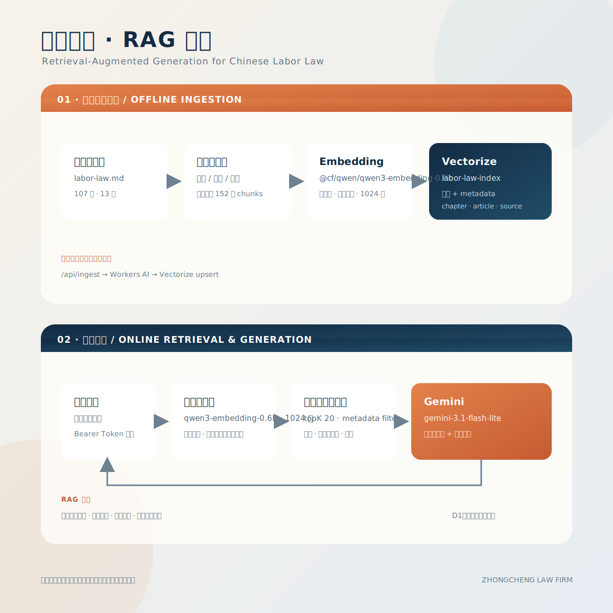

# zhongcheng-law-firm

Cloudflare Pages site for the Zhongcheng Law Firm project.

## Admin Access

The `/admin` page and `/api/admin/logs` endpoint are protected with Cloudflare Access JWT validation.

Set these Pages environment variables:

- `CF_ACCESS_DOMAIN` - your Zero Trust team domain, for example `https://<team>.cloudflareaccess.com`
- `CF_ACCESS_AUD` - the Access application audience tag
- `CF_ACCESS_ALLOWED_EMAILS` - comma-separated admin emails, defaults to `shakechen@126.com,shake.chen@gmail.com`

Cloudflare Zero Trust dashboard setup:

1. Go to `Zero Trust -> Access -> Applications`.
2. Create a `Self-hosted` application for the site.
3. Protect the `/admin*` path.
4. Allow only the identities you want to use.

## Vectorize Recall

The labor-law index uses `@cf/qwen/qwen3-embedding-0.6b` with 1024-dimensional vectors and metadata indexes on `chapter`, `article`, `source`, and `corpusVersion`.
After changing the ingest logic, re-run the ingest endpoint once so existing vectors pick up the normalized metadata:

`/api/ingest?code=zhongcheng-ingest-2026`

When the source document is materially revised, bump `CORPUS_VERSION` in `functions/_shared/rag.ts` and run the ingest endpoint again. Queries are restricted to the active corpus version so stale vectors cannot be returned.

## Insurance Law Corpus

The insurance-law corpus is isolated from the labor-law corpus in `insurance-law-qwen3-index`. It uses the same Qwen3 Embedding model and 1024-dimensional cosine vectors, with metadata indexes on `chapter`, `article`, `source`, and `corpusVersion`.

Run the protected insurance ingestion endpoint after deploying a revised `insurance-law.md`:

`/api/ingest-insurance?code=zhongcheng-insurance-ingest-2026`

The chat route sends insurance-specific questions to the insurance index, labor-specific questions to the labor index, and cross-domain questions to both indexes with source labels in the context.

## RAG Architecture

The site uses Retrieval-Augmented Generation (RAG): it retrieves relevant labor-law articles from Cloudflare Vectorize before asking Gemini to generate an answer.

  

